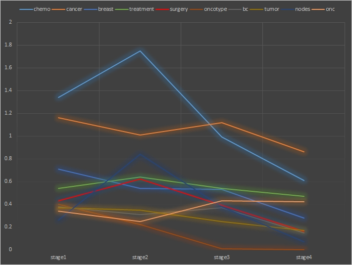

This line of research investigates the role played by new media in people’s health management and communication. Some of my recent projects use natural language as a window glancing into breast cancer patients’ online social support solicitation and disease coping.

## Publications

**Chen, M.**, & Zhao, L. (2020). [Mapping breast cancer survivors’ psychosocial coping along disease trajectory: A language approach](https://pubmed.ncbi.nlm.nih.gov/32403950/). *Journal of Health Psychology* 1, 1-14

**Chen, M.**, Bell, R. A., & Barnett, G. (2020). [From network positions to language use: Understanding the effects of brokerage and closure structures from a linguistic perspective](https://www.tandfonline.com/doi/abs/10.1080/10410236.2020.1731776?journalCode=hhth20). *Health Communication* 1, 1-8

**Chen, M.**, & Peña, J. (2018). The effects of physical poses on risk-taking behaviors and signature size after playing with a motion-controlled video game. *Health & New Media Research* 2, 120-133

Peña, J., & **Chen, M**. (2017). [With great power comes great responsibility: Superhero primes and expansive poses influence prosocial behavior after a motion-controlled game task](https://www.sciencedirect.com/science/article/abs/pii/S0747563217304612). *Computers in Human Behavior* 76, 378-385

Peña, J., & **Chen, M.** (2017). [Playing with power: Power poses affect enjoyment, social presence, controller responsiveness, and arousal when playing natural motion controller games](https://www.sciencedirect.com/science/article/abs/pii/S0747563217300924). *Computers in Human Behavior* 71, 428-435

Li, S., Feng, B., **Chen, M.**, Bell, R.A. (2015). [Physician review websites: effects of the proportion and position of negative reviews on readers' willingness to choose the doctor](https://pubmed.ncbi.nlm.nih.gov/25749406/). *Journal of Health Communication* 20, 453-461
